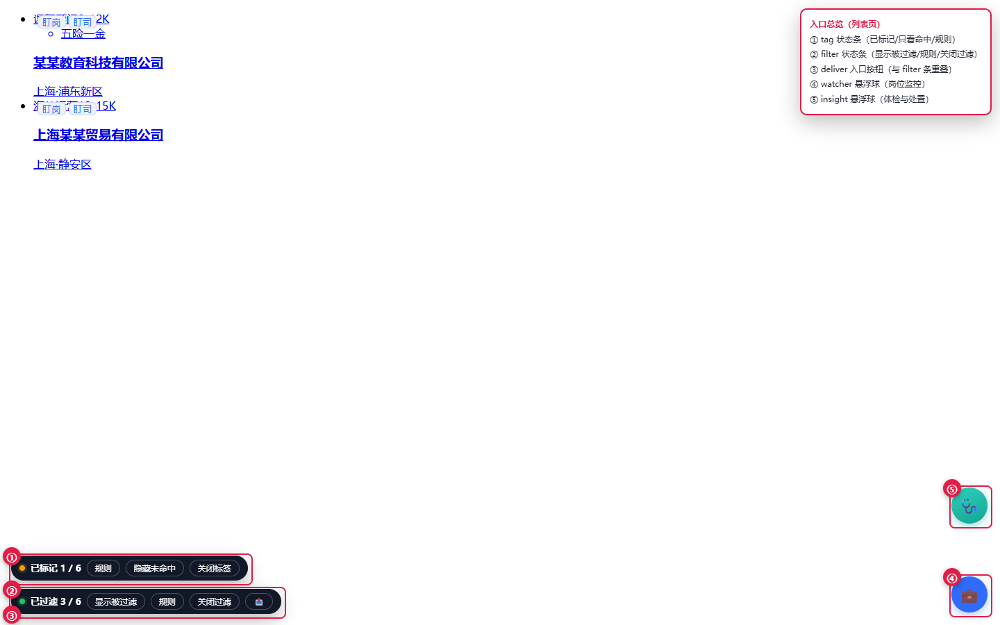

# BOSS 求职脚本套件（用户脚本 / 油猴）<a id="top"></a>

> 6 个跑在你自己浏览器里的求职辅助脚本：把招聘网站的职位列表，变成一条能**筛选 → 盯住 → 复盘 → 体检**的信息流。
> 全部只读；所有数据只存在你本机，项目没有任何服务端。（唯一会写账号、会替你发消息的「一键投递」不在公开仓库分发，见 [安装说明](docs/install.md)。）



[](https://github.com/weishiji668/boss-zhipin-userscripts/actions/workflows/ci.yml)
[](LICENSE)

---

## ⚠️ 先读风险（这一节比功能重要）

- **和任何招聘平台都没有关系**：未获得授权、未获认可，不是官方工具。
- **可能违反平台用户协议**，并可能触发风控（降权、限制沟通、封号）。用不用、怎么用，由你自己判断和承担。
- **建议用求职专用账号**，不要在办公电脑 / 办公网络上使用（上网行为监控 + 账号风控双重风险）。
- **只有一个脚本会改你账号里的东西**：`boss-insight` 的处置按钮（标不感兴趣 / 拉黑 / **删除会话（不可逆）**），且只在你点击时执行。
- **唯一会替你发消息的「一键投递」脚本不在公开仓库分发** —— 只私下交给信任的人，理由见文末「关于第 7 个脚本」。
- **不要在日常账号上开着浏览器调试端口浏览招聘站**：站点会扫描本机端口（见 [docs/risk-and-safety.md](docs/risk-and-safety.md)）。
- 完整免责声明见本文末尾。

## 这套脚本解决什么问题

```
职位列表页
   │
   ├─ ① boss-filter   把不想要的岗位直接隐藏（排除词 / 薪资 / 公司与地点黑名单）
   ├─ ② boss-tag      给「想要的」打标记，只标记不隐藏
   │
   ├─ ③ boss-watcher  把重点岗位收录进来，之后你浏览时它比对：降薪 / 要求拔高 / 换 HR / 下线

   │
   ├─ ④ boss-chat     在消息页顺手归档会话：该你回 / 该催 / 已有联系方式，可导出复盘表
   ├─ ⑤ boss-insight  扫「对方发来的消息」里的风险词（押金 / 培训贷 / 加微信转账…），可一键处置
   └─ ⑥ boss-consist  比对卡片小标签与详情正文，挑出「卡片写大专、正文要本科」这类矛盾
```

6 个脚本之间**不联网通信**，全靠本机存储（`localStorage` + 油猴存储）与页面上的 `data-*` 标记协作，
协议细节见 [docs/architecture.md](docs/architecture.md)。

## 和「客户端型 / 授权型」工具的区别

同类里最常见的做法是「桌面客户端 + 你登录一次 + 它拿 Cookie 代你跑」，并用 stealth 插件抹掉自动化特征。本项目走的是另一条路：

- **不接管账号**：没有服务器，Cookie 不出你的浏览器；
- **不做检测规避**：不伪造指纹 / UA、不绕验证码，把节奏放在人手该有的尺度上；
- **默认克制**：唯一写操作必须你手动点，每岗 10 秒、每日 50。

完整对照（含可核实的事实与来源）见 [docs/positioning.md](docs/positioning.md)。

## 六个脚本一览

| 脚本 | 作用 | 生效页面 | 读 / 写 | 风险 |
| --- | --- | --- | --- | --- |
| [boss-filter](docs/scripts/filter.md) | 页面过滤：隐藏不想要的岗位 | 职位列表页 | 只读（补取详情要手动点） | 低 |
| [boss-tag](docs/scripts/tag.md) | 命中打标签（只标记，不隐藏） | 职位列表页 | 只读 | 低 |
| [boss-watcher](docs/scripts/watcher.md) | 岗位监控：建档 / 盯住 / 变更流水 | 职位列表页 + 详情页 | 只读（收录时发 2 次请求） | 低 |
| [boss-chat](docs/scripts/chat.md) | 聊天归档、推进信号、导出复盘表 | 消息 / 聊天页 | 只读 | 低 |
| [boss-insight](docs/scripts/insight.md) | 会话风险体检 + 一键处置 | 任意站点页面 | 只读 + 点击才写 | **中**（拉黑 / 删除不可逆） |
| [boss-consist](docs/scripts/consist.md) | 卡片标签 vs 详情正文一致性体检 | 职位相关页面 | 只读（补取详情要手动点） | 低 |

> 每个脚本的权限、本机数据键、协同标记都在 `docs/scripts/` 下自动生成，跟代码保持一致。

> **关于第 7 个脚本**：唯一会写账号、替你发消息的 `boss-deliver`（一键投递）**不在本仓库分发** —— 作者只私下交给信任的人。
> 前 6 个脚本不依赖它，缺了它照常使用（列表页那个「投递本页」按钮本来就是它自己挂上去的）；`docs/architecture.md` 里仍保留它使用的协同标记，方便日后自己实现。

## 安装（约 1 分钟）

1. 任选一个用户脚本管理器：**篡改猴 Tampermonkey / 暴力猴 Violentmonkey / 脚本猫 ScriptCat**（v1.5.10 起三者都实测可用）；也可以**完全不用管理器** —— 脚本自带兼容层，直接注入页面就能跑，代价见 [docs/install.md](docs/install.md#不用管理器行不行)。
2. 点下面的链接安装（浏览器会弹出安装页，点「安装」）：

| 脚本 | 安装 |
| --- | --- |
| 页面过滤 | [boss-filter.user.js](https://raw.githubusercontent.com/weishiji668/boss-zhipin-userscripts/main/boss-filter.user.js) |
| 命中打标签 | [boss-tag.user.js](https://raw.githubusercontent.com/weishiji668/boss-zhipin-userscripts/main/boss-tag.user.js) |
| 岗位监控 | [boss-watcher.user.js](https://raw.githubusercontent.com/weishiji668/boss-zhipin-userscripts/main/boss-watcher.user.js) |
| 聊天助手 | [boss-chat.user.js](https://raw.githubusercontent.com/weishiji668/boss-zhipin-userscripts/main/boss-chat.user.js) |
| 会话体检 | [boss-insight.user.js](https://raw.githubusercontent.com/weishiji668/boss-zhipin-userscripts/main/boss-insight.user.js) |
| 一致性体检 | [boss-consist.user.js](https://raw.githubusercontent.com/weishiji668/boss-zhipin-userscripts/main/boss-consist.user.js) |


3. 打开职位列表页（例如 `https://www.zhipin.com/web/geek/job?query=...`），按 `Ctrl+Shift+R` 强刷一次。

> 换仓库时三处要一起改：脚本头部（`npm run meta:set -- --owner <用户名> --repo <仓库名>`）、上面的安装链接、
> 以及 `docs/install.md`。改完跑 `npm run check` —— `check:links` 会核对三处地址是否一致，并挡住 GitHub 建不出来的仓库名（例如中文名）。

### 一键投递不在公开仓库

第 7 个脚本 `boss-deliver`（一键投递：批量打招呼）是**唯一会写你账号**、也是唯一会替你发消息的脚本，因此**不在本仓库分发**，作者只私下交给信任的人。要装的话把 `boss-deliver.user.js` 拖进篡改猴新建脚本即可（它没有公开的 `@updateURL`，手动更新）。

## 推荐使用顺序

1. **先只装 `boss-filter`**，按自己的方向设排除词（外包 / 电销 / 低薪），看一眼「显示被过滤」确认没误伤。
2. 再加 `boss-tag` 标记真正想要的岗位（它不隐藏任何东西，纯标记）。
3. 看到特别心动的岗位，用 `boss-watcher` 收录/盯住，之后它会替你盯着降薪、加要求、下线。
4. （可选）需要主动出击时，用作者私下提供的 `boss-deliver`（一键投递）。默认每岗隔 10 秒、每天最多 50 个，撞到站点额度就停。
5. 每天收工时打开消息页看一眼 `boss-chat` 的三张卡（该你回 / 该催 / 已有联系方式）与 `boss-insight` 的风险标记。

## 安全与隐私

| 问题 | 事实 |
| --- | --- |
| 数据存在哪 | 你自己的浏览器（`localStorage` / 油猴存储）。项目没有服务器，不上传任何东西。 |
| 什么时候发请求 | 只读脚本仅在你点按钮时请求页面；`boss-watcher` 收录一次发 2 次。公开的 6 个脚本都不会主动、周期性发请求。 |
| 需要 API Key 吗 | 只有可选的 AI 功能需要，且必须你自己填 —— 仓库里没有任何内置 key。 |
| 怎么防止我误提交隐私数据 | 仓库自带 `tools/scan-private.cjs`，CI 每次都会扫本机路径 / 抓包文件 / 站方源码 / 疑似真实 key。 |

## 常见问题

**装了没反应？** 先确认脚本已启用 → 按 `Ctrl+Shift+R` 强刷 → 看面板右下角的版本号能不能对上仓库版本。若面板提示「页面世界钩子未注入」，多半是没强刷。

**页面上出现两个一样的悬浮球？** 这是**同一个脚本装了两份**（多半是早前的安装没有删掉，或换过 `@namespace`）。
油猴按 `@name` + `@namespace` 认脚本，两份会同时运行、同时写同一批本机键。到油猴的脚本列表里删掉多余那条即可。

**面板数字不对？** 多标签页同时开着时，历史版本曾出现互相覆盖，现在写盘前都会先跟磁盘合并。若仍不一致，点一次「重新统计」。

**会被封号吗？** 有可能 —— 自动化行为本身就有风险。把风险降到最低的做法：求职专用账号、每天投递量压在自设上限内、
不在公司网络用、不开调试端口。详见 [docs/risk-and-safety.md](docs/risk-and-safety.md)。

**能改成自动翻页、自动投 500 个吗？** 不会做。本项目不接受提高批量投递速率、绕过风控验证、多账号代理池这类需求，
相关 issue 会被直接关闭。

**Q：一定要装篡改猴吗？换别的管理器行不行？**

不用。脚本用的都是通用 GM 接口，v1.5.10 起对 **篡改猴 / 暴力猴 / 脚本猫** 都做了适配与自测：管理器给什么就用什么，缺的能力自己补（存储退化成 `localStorage`、同源请求走 `fetch`、菜单退化成页面内 `⚙`、样式退化成 `<style>`）。
菜单里的「🔍 环境自检（兼容层）」会直接告诉你当前跑在什么环境、哪些能力可用。详见 [docs/install.md](docs/install.md)。

## 从旧版 / 本地版升级

详见 [docs/migrate-v1.md](docs/migrate-v1.md)。一句话版本：**先删旧脚本再装新的**，否则会出现两份同时运行（两个悬浮球、重复抓取）。

## 开发

```bash
npm install
npm run dev                # 本地安装服务：http://127.0.0.1:8899/
npm run check              # 语法 + 元数据 + 私有内容 + 更新日志
npm test                   # 纯 Node 单元测试（秒级）
npm run test:all           # 含 Playwright 浏览器用例（首次需 npx playwright install chromium）
npm run changelog          # 从各脚本 @description 重新生成 CHANGELOG.md
```

```text
boss-*.user.js    6 个脚本本体（必须留在根目录：tests 按 ../boss-xxx.user.js 读它们）
docs/             使用与设计文档（docs/scripts/ 由 tools/gen-script-docs.cjs 自动生成）
images/           文档截图（本地模拟页，无真实账号信息）
tests/            Playwright + Node 测试，全部走 mock，不访问真实站点
tools/            开发与门禁：dev-server / check-syntax / verify-headers / scan-private / build-changelog / check-doc-links / set-repo-meta
.github/          CI 与 issue / PR 模板
```

### 发布检查单（维护者）

```bash
npm run meta:set -- --owner <用户名> --repo <仓库名> --author <署名>   # 首次：写入 @homepageURL/@updateURL 等
npm run changelog                                                     # 版本号或说明改过就重跑
npm run check && npm run check:headers:strict                         # 严格模式会拦住没替换的占位地址
npm run test:all                                                      # 浏览器用例全绿
git tag v2026.09.23 && git push --tags                                # 打标签 → 写 Release
```

## 参考与致谢

- 取数思路与「120/150 位限额语义」参考了开源项目 [Ocyss/boss-helper](https://github.com/Ocyss/boss-helper)（MIT）；
  经逐行比对确认**未复制其代码**，详见 [NOTICE](NOTICE)。
- 站点接口路径与字段名属于技术事实，本项目不包含任何站点前端源码或真实抓包数据。
- 界面截图均为本地模拟页面；页面样式与商标版权归原站方所有。

## 免责声明

```
本项目是个人学习与研究用的浏览器用户脚本集合，用于改善自己在招聘网站上的浏览与记录体验。

· 与任何招聘平台均无关联，未获得其授权或认可；
· 不提供账号、代理、代运营或自动化服务，不承诺任何求职结果；
· 使用可能违反平台用户协议，并可能触发风控（降权、限制沟通、封号），风险由使用者自担；
· 建议使用求职专用账号，不要在办公设备 / 办公网络上使用；
· 所有数据默认只存在使用者本机浏览器，项目不收集、不上传任何个人信息；
· 请自行评估所在地法律法规与平台规则，作者不对使用后果承担责任。

This project is for personal study only, is not affiliated with any recruiting platform,
and comes with no warranty. Use at your own risk.
```

## 许可证

[MIT](LICENSE)
